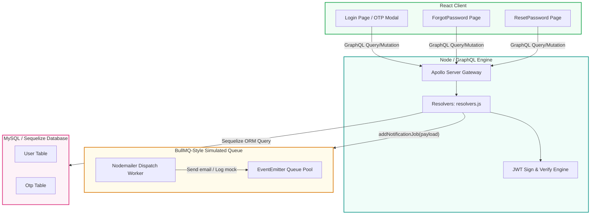
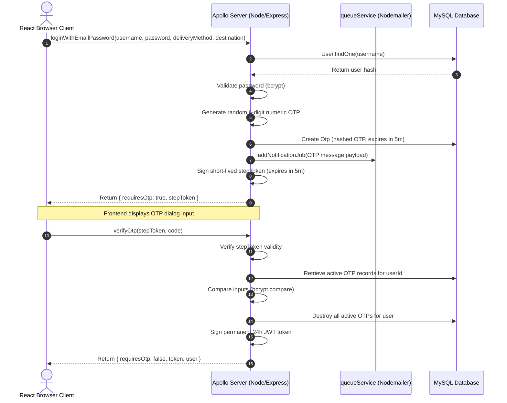
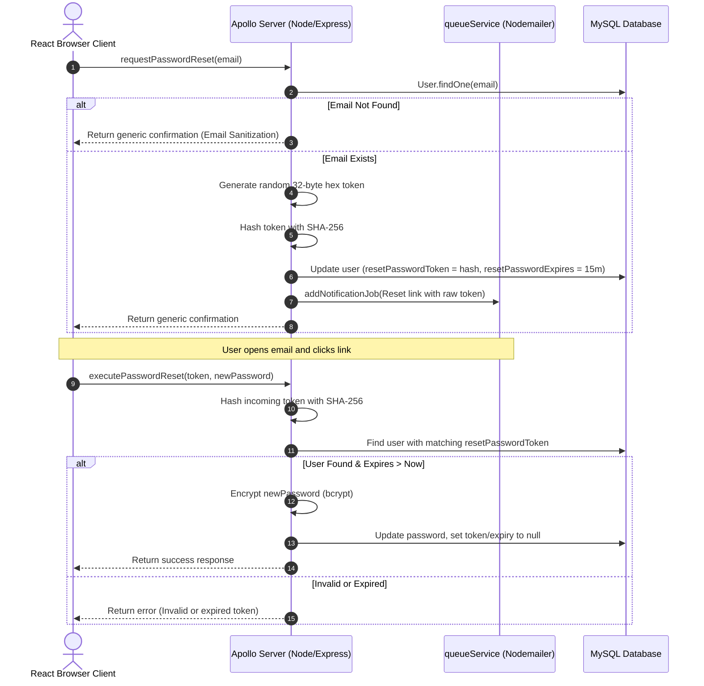

# DevFlow Workspace — Enterprise Full-Stack Capstone

An enterprise-grade project tracking and team collaboration workspace featuring a real-time synchronized task dashboard, robust Multi-Factor Authentication (MFA), and a cryptographically secure transactional recovery system.

This project was built following a strict "Mastery-First" dual-track strategy. The full-stack data pipeline, database models, and layout patterns were first validated on a simplified sandbox application (QuickTask). Once the baseline architectural flow was mastered, development skipped static Vanilla JS rendering entirely to implement DevFlow directly using modern, component-driven framework architectures.

---

## 🏗️ System Architecture

The ecosystem relies on an event-driven notification engine and a multi-stage GraphQL gateway overlay to ensure absolute process isolation and transactional security:

- **Frontend Client**: Built using React (Vite), Tailwind CSS, and shadcn/ui components. Manages real-time UI state hooks and isolates authenticated context flows.
- **API Gateway**: Powered by Node.js, Express, and Apollo Server. Serves as a single entry point for all application queries and mutations.
- **Real-Time Sync Engine**: Utilizes Socket.io to handle bidirectional data synchronization across active user sessions simultaneously.
- **Persistent Storage**: Uses a MySQL database managed natively through the Sequelize ORM framework.
- **Asynchronous Background Worker**: A local simulated messaging queue engine built using an in-memory EventEmitter abstraction layer to offload high-latency communication tasks from the primary API thread.

### Architecture Flow



---

## 🔒 Advanced Engineering Features Implemented

### I. Multi-Factor Authentication (MFA) via Two-Step OTP
Designed to eliminate session-hijacking liabilities inherent to standard stateless authentication schemas.

* **Context Interception**: Upon parsing a valid email and password combo, the `loginWithEmailPassword` mutation halts token generation. It randomly computes a secure 6-digit numeric OTP, hashes it via bcrypt, and registers it to an active Otp database record with a 5-minute Time-To-Live (TTL).
* **State Protection via stepToken**: The server signs and yields a highly restricted intermediate `stepToken` containing the encrypted payload string `{ type: "MFA_STAGE" }`.
* **Dropdown UI Modal**: The React application intercepts the response, holds the global session unauthenticated, and triggers a top-down sliding dropdown modal utilizing a shadcn/ui `InputOTP` primitive.
* **Atomic Verification**: The client fires the `verifyOtp` mutation sending the passcode alongside the `stepToken`. The gateway verifies the signature integrity, checks the input via `bcrypt.compare`, flushes the row to prevent replay attacks, and signs the permanent 24-hour access JWT payload.



### II. Secure Token-Based Password Recovery Flow
A cryptographically secure password restoration flow built to defend against account spoofing and data sniffing.

* **Email Enumeration Shielding**: The `requestPasswordReset` mutation processes requests with uniform completion latency and outputs an identical string message (*"If an account exists, a reset link has been sent"*) whether the email exists or not. This blocks dictionary harvesting scripts trying to scan active platform accounts.
* **Cryptographic Token Generation**: If an account exists, Node’s native `crypto` engine generates a secure raw 32-byte hex token string. This token is hashed using SHA-256 before database entry, rendering it useless to bad actors if a database leak occurs.
* **Parameter Extraction**: The plain-text token string is dispatched embedded inside a recovery hyperlink. When clicked, the React application captures the token using `useSearchParams`.
* **Atomic Commit**: The user enters a matching new password. The backend applies an SHA-256 hash to the incoming token parameter, queries the database, checks the 15-minute expiration timestamp, updates the credential via bcrypt, and resets all tracking columns to null to enforce single-use execution.



### III. Asynchronous Background Task Queue Layer
Decouples high-latency I/O routines (such as sending emails via Nodemailer or printing terminal log blocks) to maintain rapid execution loops.

Instead of letting external relays create performance bottlenecks during live mutations, the resolver pushes a structured JSON task payload to `addNotificationJob(payload)` and immediately returns a success status to the client. An isolated worker consumes the event pool asynchronously behind the scenes.

---

## 💾 Relational Database Schema Model

The persistence layer establishes a relational hierarchy to map data dependencies and maintain cross-workspace isolation:

```javascript
// User Table Structure - Mapped via Sequelize ORM to MySQL
export const User = sequelize.define("User", {
  id: { type: DataTypes.INTEGER, autoIncrement: true, primaryKey: true },
  username: { type: DataTypes.STRING, allowNull: false, unique: true },
  password: { type: DataTypes.STRING, allowNull: false },
  role: { type: DataTypes.ENUM("user", "admin"), defaultValue: "user" },
  email: { type: DataTypes.STRING, allowNull: false },
  phoneNumber: { type: DataTypes.STRING, allowNull: false },
  // ─── EXTENDED PASSWORD RECOVERY SCHEMA FIELDS ───
  resetPasswordToken: { type: DataTypes.STRING, allowNull: true },
  resetPasswordExpires: { type: DataTypes.DATE, allowNull: true }
});
```

---

## 🛠️ Getting Started & Local Development

### 1. Environment Configurations
Create a `.env` configuration file in your backend root folder:
```env
PORT=5000
JWT_SECRET=your_super_secret_keycard_auth
SMTP_HOST=smtp.gmail.com
SMTP_PORT=587
SMTP_USER=your_email@gmail.com
SMTP_PASSWORD=your_app_specific_password
```

### 2. Dependency Installation
```bash
# Install backend requirements
cd backend
npm install

# Install frontend requirements
cd ../react-frontend
npm install
```

### 3. Execution Commands
```bash
# Run backend server (from backend folder)
npm start

# Run Vite frontend client (from react-frontend folder)
npm run dev
```

---

## 🚀 React Compiler & Tooling

### React Compiler
The React Compiler is not enabled on this template because of its impact on dev & build performances.

### Expanding the ESLint Configuration
If you are developing a production application, we recommend using TypeScript with type-aware lint rules enabled. Check out the TS template for information on how to integrate TypeScript and `typescript-eslint` in your project.
