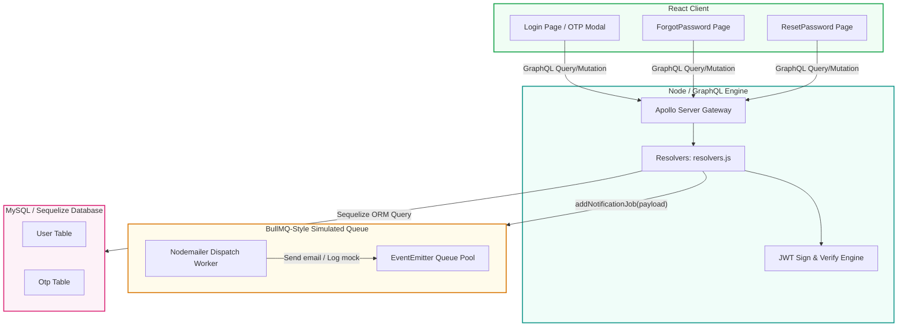
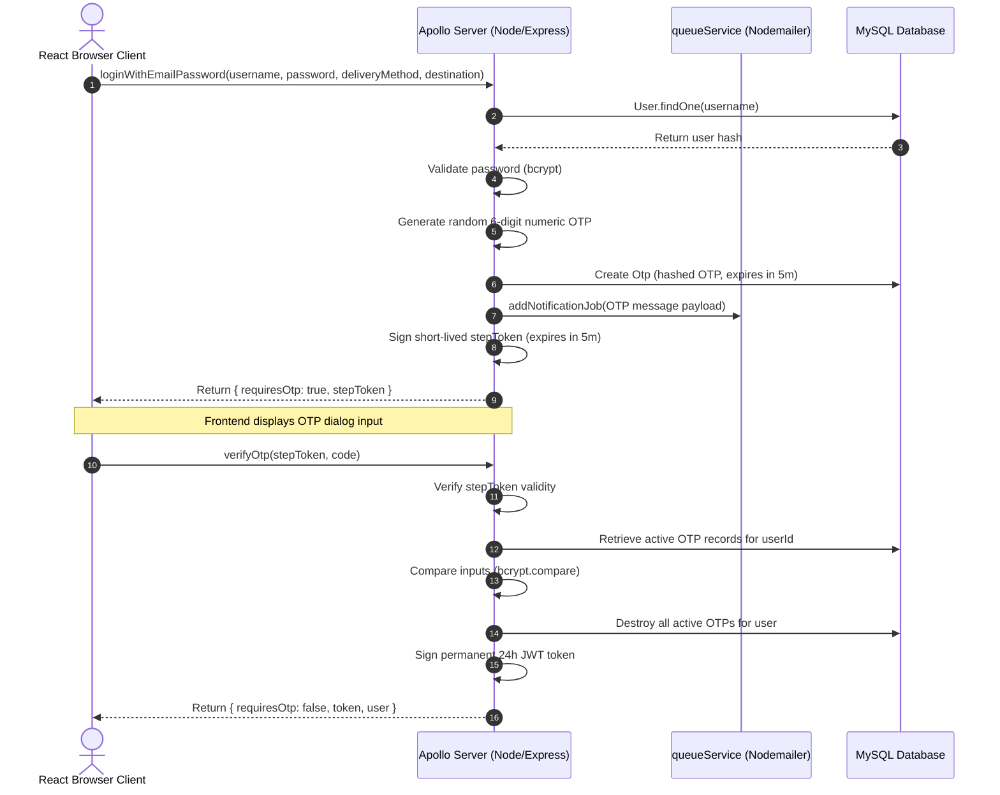
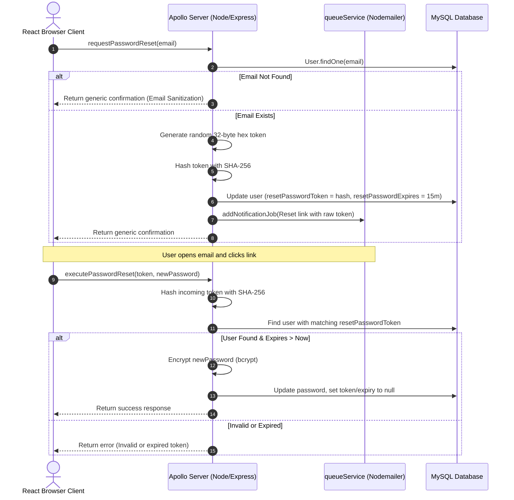

# DevFlow Authentication Architecture Reference

This reference manual documents the two critical security flows in the DevFlow workspace application:
1. **Multi-Factor Authentication (MFA) via OTP (Email/SMS)**
2. **Secure Token-Based Password Reset**

---

## 🏗️ System Architecture

The authentication security layer is divided into five main parts:



---

## 🔒 Part 1: Password OTP Verification (MFA)

This flow protects account access by sending a one-time passcode (OTP) to the user's secondary channel (Email/SMS) before issuing a final JSON Web Token (JWT).

### Flow Breakdown



### Core Code Manifest (OTP)

#### 1. Database Model: [Otp.js](file:///d:/projects/CodvedaInternship/todoV2/backend/src/models/Otp.js)
Stores the hashed passcode for matching, securing data even in the event of a database dump.
```javascript
export const Otp = sequelize.define("Otp", {
  userId: {
    type: DataTypes.INTEGER,
    allowNull: false,
  },
  codeHash: {
    type: DataTypes.STRING,
    allowNull: false, // Hashed OTP codes
  },
  purpose: {
    type: DataTypes.ENUM("LOGIN", "REGISTER"),
    defaultValue: "LOGIN",
  },
  expiresAt: {
    type: DataTypes.DATE,
    allowNull: false,
  },
});
```

#### 2. Mutation Resolvers: [resolvers.js](file:///d:/projects/CodvedaInternship/todoV2/backend/src/graphql/resolvers.js)
Handles verification, OTP storage, temporary state tokens, and final session tokens.

> [!TIP]
> The **`stepToken`** is signed with a special payload key (`{ type: "MFA_STAGE" }`) so it cannot be swapped with a normal authentication token to bypass verification.

```javascript
// Step 1: Validate Password & Dispatch OTP
loginWithEmailPassword: async (_, { username, password, deliveryMethod, mfaDestination }) => {
  const user = await User.findOne({ where: { username } });
  if (!user) throw new Error("Invalid username or credentials.");

  const isMatch = await bcrypt.compare(password, user.password);
  if (!isMatch) throw new Error("Invalid username or credentials.");

  const generatedOtp = String(Math.floor(100000 + Math.random() * 900000));
  const hashedOtp = await bcrypt.hash(generatedOtp, 10);
  
  await Otp.create({
    userId: user.id,
    codeHash: hashedOtp,
    expiresAt: new Date(Date.now() + 5 * 60 * 1000), // 5 minutes
  });

  const destination = mfaDestination || (deliveryMethod === "SMS" ? user.phoneNumber : user.email);

  addNotificationJob({
    to: destination,
    type: deliveryMethod,
    body: `Your secure pin code is: ${generatedOtp}. Valid for 5 minutes.`,
  });

  const stepToken = jwt.sign(
    { userId: user.id, type: "MFA_STAGE" },
    JWT_SECRET,
    { expiresIn: "5m" }
  );

  return { requiresOtp: true, stepToken, user: null, token: null };
}
```

```javascript
// Step 2: Validate OTP Code & Grant Session Token
verifyOtp: async (_, { stepToken, code }) => {
  const decoded = jwt.verify(stepToken, JWT_SECRET);
  if (decoded.type !== "MFA_STAGE") throw new Error("Invalid stage signature.");

  const user = await User.findByPk(decoded.userId);
  const activeOtps = await Otp.findAll({ where: { userId: user.id } });

  let validOtpRecord = null;
  for (const record of activeOtps) {
    if (new Date() < new Date(record.expiresAt)) {
      const match = await bcrypt.compare(code, record.codeHash);
      if (match) {
        validOtpRecord = record;
        break;
      }
    }
  }

  if (!validOtpRecord) throw new Error("The verification code is incorrect or expired.");

  // Clean up used tokens
  await Otp.destroy({ where: { userId: user.id } });

  const permanentToken = jwt.sign(
    { id: user.id, username: user.username, role: user.role },
    JWT_SECRET,
    { expiresIn: "24h" }
  );

  return { requiresOtp: false, token: permanentToken, user };
}
```

---

## 🔑 Part 2: Secure Password Reset Flow

Allows users to recover access to their accounts without password sharing, relying on a secure, single-use, timed token link dispatched via email.

### Flow Breakdown



### Core Code Manifest (Password Reset)

#### 1. Model Extension: [User.js](file:///d:/projects/CodvedaInternship/todoV2/backend/src/models/User.js)
Stores the hashed token (preventing token misuse in database leaks) and the 15-minute expiration time.
```javascript
resetPasswordToken: {
  type: DataTypes.STRING,
  allowNull: true,
},
resetPasswordExpires: {
  type: DataTypes.DATE,
  allowNull: true,
},
```

#### 2. Mutation Resolvers: [resolvers.js](file:///d:/projects/CodvedaInternship/todoV2/backend/src/graphql/resolvers.js)

> [!WARNING]
> **Email Enumeration Defense**: The resolver always returns the same success message regardless of whether the email exists in the database. This prevents attackers from testing usernames or emails to see if they are active on the site.

```javascript
requestPasswordReset: async (_, { email }) => {
  const user = await User.findOne({ where: { email } });
  
  if (!user) {
    // Return identical message to prevent email enumeration
    return "If an account exists with this email, a reset link has been sent.";
  }

  // Generate unique unhashed token
  const token = crypto.randomBytes(32).toString("hex");
  // Store hashed version
  const hashedToken = crypto.createHash("sha256").update(token).digest("hex");
  const expiresAt = new Date(Date.now() + 15 * 60 * 1000); // 15 minutes

  user.resetPasswordToken = hashedToken;
  user.resetPasswordExpires = expiresAt;
  await user.save();

  const resetLink = `http://localhost:5173/reset-password?token=${token}`;

  addNotificationJob({
    to: user.email,
    type: "EMAIL",
    subject: "Password Reset Request",
    text: `Hello ${user.username},\n\nYou requested a password reset.\n\nClick the link below to reset your password:\n\n${resetLink}\n\nThis link is valid for 15 minutes.`,
  });

  return "If an account exists with this email, a reset link has been sent.";
}
```

```javascript
executePasswordReset: async (_, { token, newPassword }) => {
  if (!token) throw new Error("Token is required.");
  if (!newPassword || newPassword.length < 6) throw new Error("Password too short.");

  const hashedToken = crypto.createHash("sha256").update(token).digest("hex");
  const user = await User.findOne({ where: { resetPasswordToken: hashedToken } });

  if (!user || new Date() > new Date(user.resetPasswordExpires)) {
    throw new Error("Invalid or expired password reset token.");
  }

  user.password = await bcrypt.hash(newPassword, 10);
  user.resetPasswordToken = null;
  user.resetPasswordExpires = null;
  await user.save();

  return "Password successfully reset.";
}
```

#### 3. Client View: [ResetPassword.jsx](file:///d:/projects/CodvedaInternship/todoV2/react-frontend/src/pages/ResetPassword.jsx)
Extracts parameter tokens using `useSearchParams` and handles mutations:
```javascript
const [searchParams] = useSearchParams();
const token = searchParams.get("token");

const [executePasswordReset, { loading }] = useMutation(EXECUTE_PASSWORD_RESET);

const handleSubmit = async (e) => {
  e.preventDefault();
  if (password !== confirmPassword) {
    setError("Passwords do not match.");
    return;
  }
  try {
    await executePasswordReset({ variables: { token, newPassword: password } });
    setMessage("Password successfully reset. Redirecting to login...");
    setTimeout(() => navigate("/login"), 2000);
  } catch (err) {
    setError(err.message);
  }
};
```

---

## 📨 Part 3: Notification Dispatch Engine

Both systems share a mock-capable background email dispatcher located in [queueService.js](file:///d:/projects/CodvedaInternship/todoV2/backend/src/services/queueService.js).

### Configuration Switch
The queue operates in two modes depending on env configurations:
- **Mock Sandbox Mode**: Default. If `SMTP_USER` and `SMTP_PASSWORD` are missing, it outputs emails straight to the Node terminal logs.
- **SMTP Gateway Mode**: Triggered when `SMTP_USER` and `SMTP_PASSWORD` are present. It establishes a secure link to Gmail's relay servers (`smtp.gmail.com:587`).

```javascript
const { to, type, body, subject, text } = job;
if (type === "EMAIL") {
  await transporter.sendMail({
    from: `"DevFlow System's Authentication" <${smtpUser || 'security@todoapp.com'}>`,
    to,
    subject: subject || "Your OTP Verification Code",
    text: text || `Hello,\n\n${body}\n\nDevFlow Security Team.`,
  });
}
```
